# Levente Toth - T2A2 - Art Haus

## Contents

- [App Description](#app-description)
  - [Functionality and Features](#functionality-and-features)
  - [Future Developments](#future-developments)
  - [Sitemap](#sitemap)
  - [Example Screenshots](#example-screenshots)
- [User Stories](#user-stories)
- [Wireframes](#wireframes)
- [ERD, Schema, Models and Database Relations](#erd-schema-models-and-database-relations)
  - [Entity Relationship Diagram (ERD)](#entity-relationship-diagram-erd)
  - [Schema](#schema)
  - [Models and Database Relations](#models-and-database-relations)
    - [Model and Relationship Design](#model-and-relationship-design)
      - [ActiveRecord Associations](#activerecord-associations)
      - [Relational Integrity](#relational-integrity)
    - [Schema Design](#schema-design)
- [High Level Components](#high-level-components)
- [Third Party Services](#third-party-services)
- [Task and Project Management](#task-and-project-management)

## App Description

Artists are often limited by the decisions of art dealers, and galleries. Due to the constraints of finite space and time, as well as the desire for profit, dealers and galleries limit artist exposure, reach and profits.

Making it harder for artists to create and display their work through the above constraints means less art for the world. In an age approaching post-scarcity the human race needs more and more ways to ponder about themselves and their surroundings. More ways to find meaning, more ways to express themselves.

The 2-way marketplace web application *Art Haus* has been created as a tool to help, by removing the middle man (art galleries or exclusive dealers) and connecting artists and art collectors directly to other collectors and admirers of art.

The target audience is Australian artists and Australians who appreciate art.

View the live website for Art Haus [here](https://enigmatic-mountain-10943.herokuapp.com/).

View the source code and version control repository [here](https://github.com/LevPewPew/art-market).

The following tech stack and plug-ins/services were used to achieve what is outlined below:

- HTML
- CSS/SCSS
- JavaScript
- Ruby
- Ruby on Rails
- Stripe
- AWS S3
- Heroku

### Functionality and Features
- Database to track entities such as Users, Listings, etc.
- Create user accounts with authorization and authentication (using Devise package).
- Any User account can both buy and sell art.
  - User can post a Listing to app for potential buyers to view or purchase.
  - User can browse art and use a search bar the look for specific artists.
  - User can purchase listed art.
- Payment Processing (using Stripe plug-in).
- Cloud Storage (using Amazon Web Services S3 plug-in).
- reCAPTCHA security to prevent spam or automated Listings from bots.
- Search bar (using Ransack package)
- Functional testing suite, (using Capybara package, use the command ```rspec spec/features``` in the project folder to run tests).
- GPS location with Google Maps API and approximate location indicator (**NOTE:** sometimes the Geocoder times out before it can get anything even with a long timeout time, in this case the map will just point to the North Pole and a Flash Error will inform the user).
- Admin User role, has authority to take CRUD actions on Object's not owned by them. Also has access to Admin Dashboard.
- Admin Dashboard. Can view all users here and manage their account details. Can also view site statistics.
- Communications Manager User role, has authority to edit or delete any Comments.
- A custom validator to ensure all Comments on a Listing cross a minimum threshold of pretentiousness. **ATTENTION:** This custom validator **is a joke**, it was made for the sake of learning how to do custom validators and regex (it can be found in ```/src/app/models/concerns/pretentiousness_validator.rb```). I would never implement this on a real website. To pass this validator you must use one of the following words at least once: universality, humanity, inhumanity, emotion, invokes, feelings, sense of, unrelenting, consumerist, fetishism, yearning, traditional, post-modern, zeitgeist.

### Future Developments

Some functionality and features for the future I would have liked to include but didn't have enough time for are:

- Starred Listings, to bookmark them on a User's account.
- Sort by "Trending", i.e. listings with lot's of views and stars at the top.
- Search bar that searches for Listings with a certain Style, searching related models is an "advanced mode" feature of the Ransack gem that I didn't have time to implement.
- Direct Message communication between Buyers and Sellers.
- On Purchase of a Listing, change the approximate location marker on GPS to an exact one, and reveal the address of the Listing Owner to the Buyer.
- Use of the CanCan gem for User Account Authorization management. I decided to avoid using a package because I felt this site would be relatively small and simple given the time frame, but in hindsight even a site this small and simple would have benefited greatly from abstracting authorization to be managed in a central location as it became a bit messy and hard to track having authorization checks spread throughout all the views and controllers.
- Better and more comprehensive Functional Tests. I ran into difficulties creating objects using Factory Bot in Capybara to create dummy data when creating Objects that use related models. So instead I had to create them "live" by having the test scripts go through User and Listing instantiation by filling in forms on the website, this adds a lot of overhead to the tests in code as well as time to execute.
- Change Purchases entities to be a duplicate of a Listing entity, rather than a join table to link Users that purchased to Listing they purchased. This is to allow a Users purchase history to not be have missing entires when the Seller of a Listing they purchased has their account deleted which deletes the related Listings. Originally I did this as join table as I thought I shouldn't create more data than I need to, not considering this limitation that would result from it.
- On slower connections, it can take a while to render a Listing index due to all the images not being scaled down to a smaller file size appropriate to the displayed dimensions of the images. In the future I would account for this by following [this guide](https://aws.amazon.com/blogs/compute/resize-images-on-the-fly-with-amazon-s3-aws-lambda-and-amazon-api-gateway/).
- Notifications, both in app and via email using a service such as Mailgun.
- Support for non-Australian users.
- Responsiveness and design for mobile use.

### Sitemap

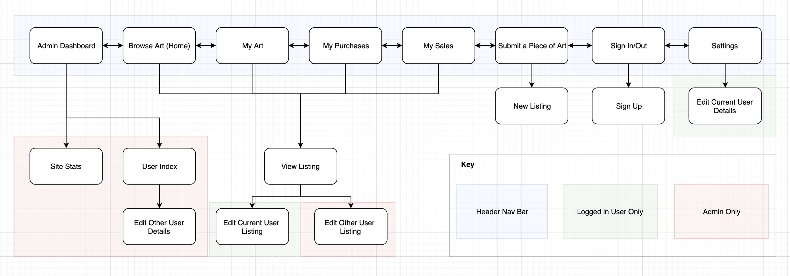

### Example Screenshots

<TODO add screens when app is completed>

## User Stories

*Buying a Piece:*
The a brand new User will start browsing the listings on the home page and see a piece of art that looks interesting. They then click on that piece to see more high resolution photos and perhaps read a background on the piece or the artist. Deciding they would like to own the piece they then click a purchase button. Being a new user they have no account and are prompted to make a new one and enter their information. Once this is complete they enter payment details into the Stripe payment plug in to complete their purchase. A Purchase history is now present in their account.

*Selling a Piece:*
A new artist who already has an account logs in and decides they want to list one of their pieces. They go to their personal listings page which currently is empty. The click a New Listing button and are then taken to a new listing page where they fill in the details of their listing. Once they submit they are returned to their current listings page where they can see a new listing item that contains all the details they entered as well as the pick up location which is the address they have in their User account details.

## Wireframes

### Home Page

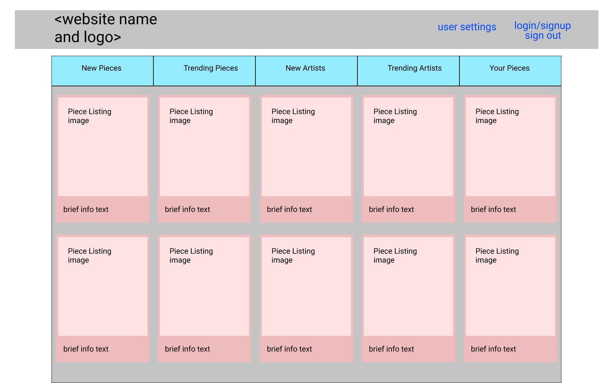

### Log In


### New User

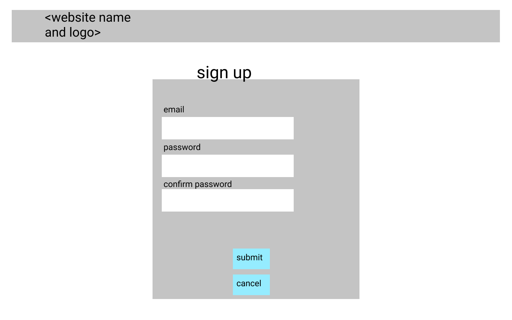

### New/Edit Listing

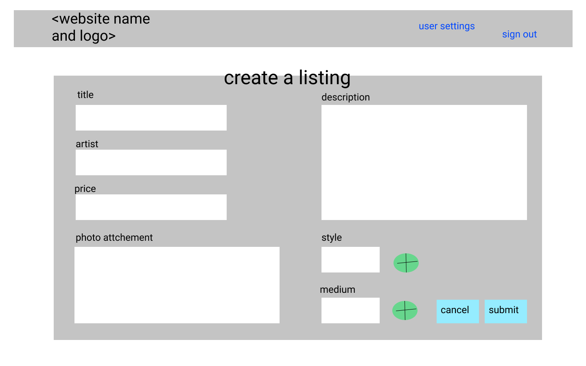

### Show Listing

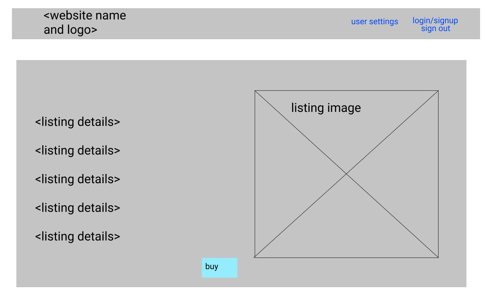

### Successful Listing

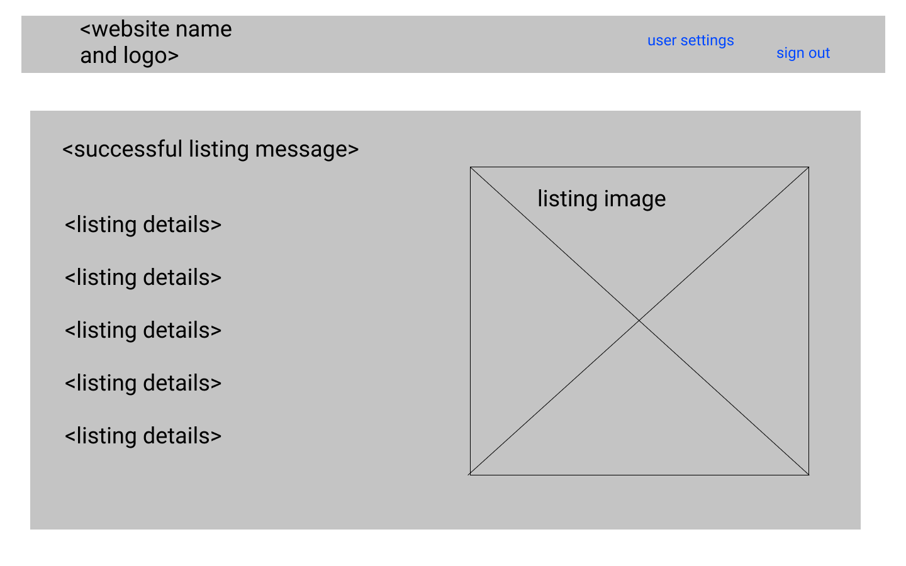

### Successful Purchase

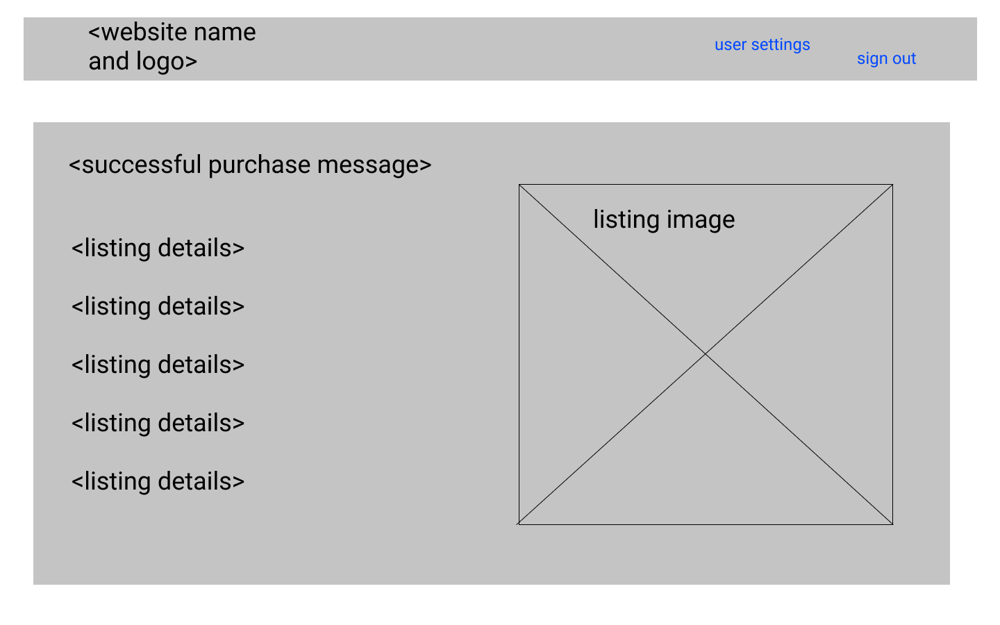

### User Settings

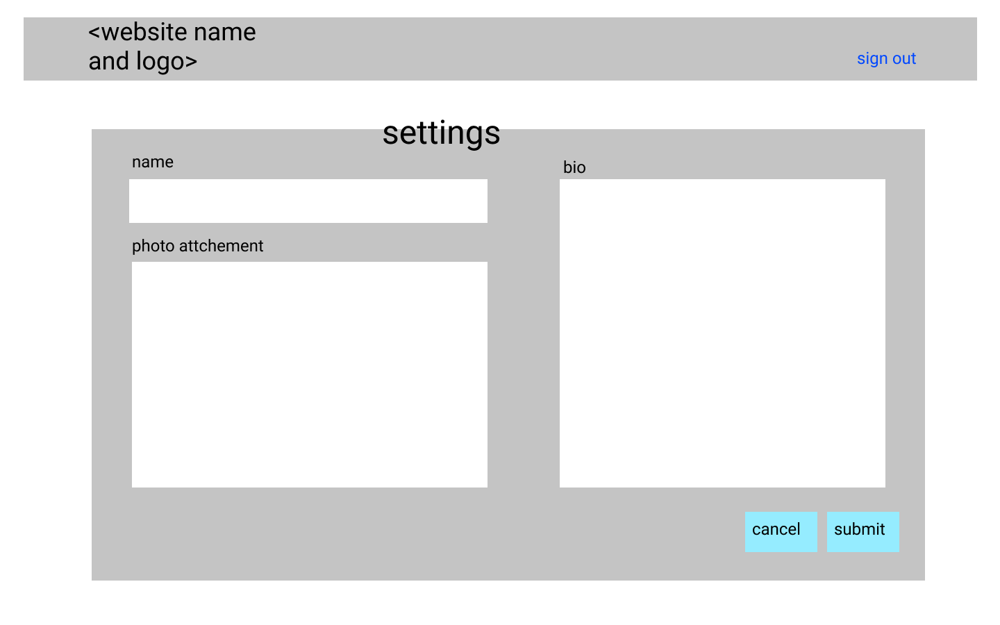

## ERD, Schema, Models and Database Relations

### Entity Relationship Diagram (ERD)

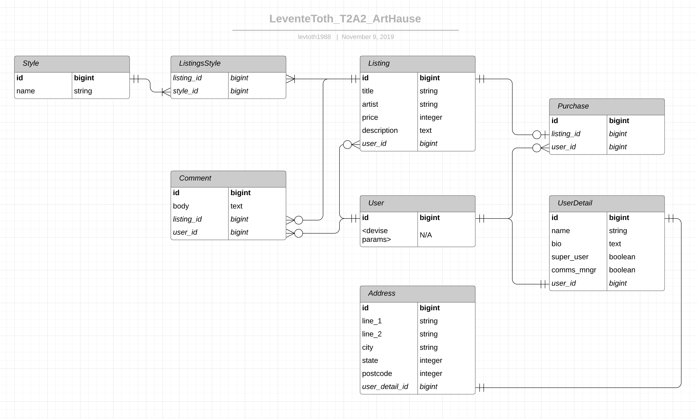

### Schema

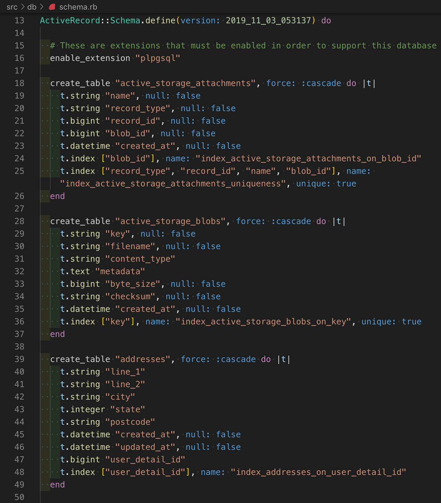


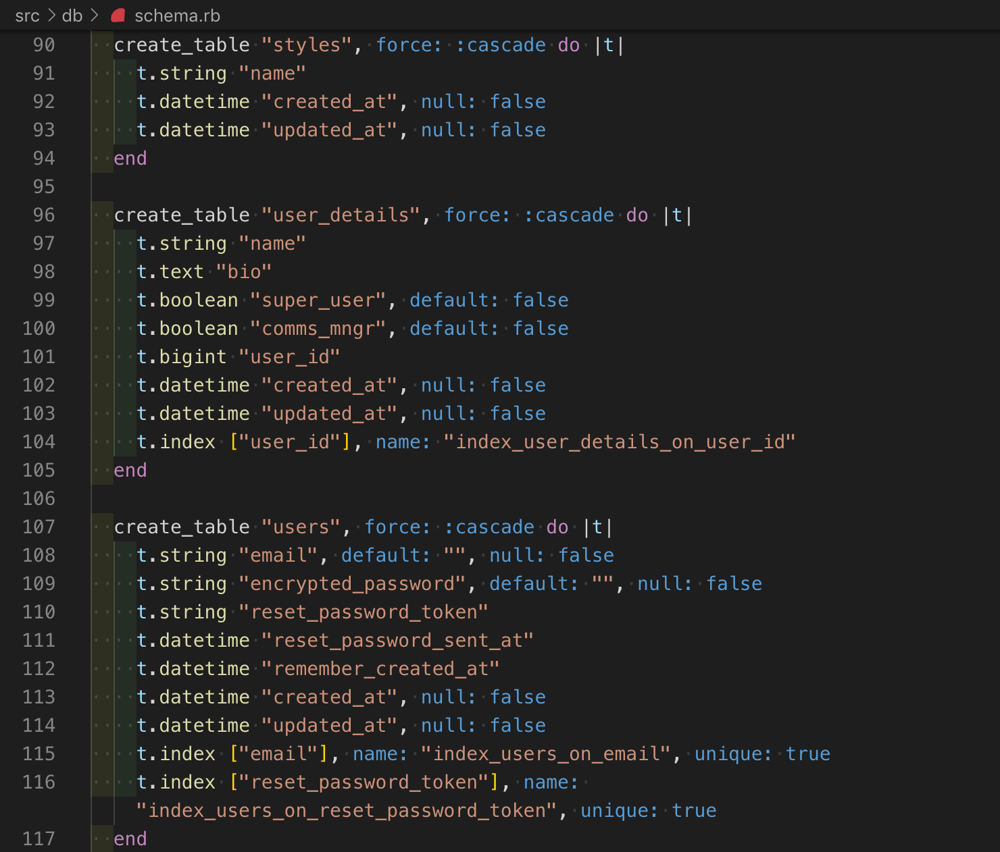

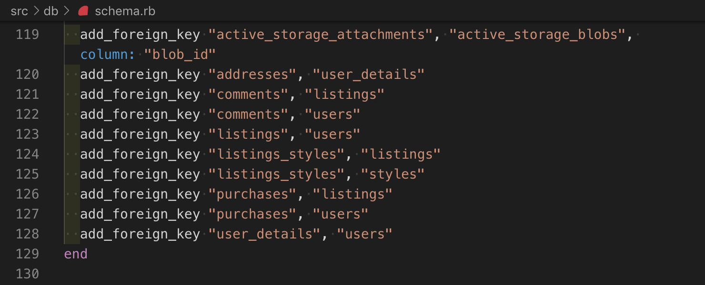

### Models and Database Relations

#### Model and Relationship Design

A User is a model generated by the *Devise* package, as such it has the default parameters created by Devise. I had heard there can be difficulties adding custom parameters onto this Devise generated model so given the time constraints I decided to create related models to expand upon the User model rather than attempting to add the parameters directly onto the User Model. This is seen with the *One and Only to One and Only One* relationship between the User and UserDetail models, and the *One and Only to One and Only One* relationship between the UserDetail and the Address models. The Address is given it's own model so as to allow normalization of address data without cluttering the UserDetail model.

The Listing model has several related models:

The Style model (which is a list of art styles a listing can choose from to help describe it, e.g. Impressionism, Cubism, Minimalism, etc) is linked to the Listing model via a join table named ListingsStyle model. A join table was used as Listing and Style have a *Many to Many* relationship as many different Listings could share the same style but work of art could potentially be categorized by more than one style if it takes aspects from several art movements, e.g. a Surrealist Psychedelic painting, or a Minimalist piece of Street Art. Although not enforced through model validation in any way, the New/Edit Listing forms only allows the possibility of 3 Styles being linked to a Listing, this is to prevent users from claiming a listing is every type of art style possible to show up in more searches.

The Listing model has a *One to Many* relationship with the Comment model. Users can post comments on the Listing show page to discuss the art work. Obviously in order to have a conversation or more than one comment on a listing the Comment model will have a Foreign Key referencing the Listing ID to create the One to Many relationship.

And of course the Listing has a *Many to One* relationship with the User model via it's Foreign Key that references a User ID to allow a User to post several Listings at a time.

Purchases are a type of join table to link Users to Listings whenever a User purchases a Listing. The Purchases table is two Foreign Keys, one to reference the purchased Listing and another to reference the User who purchased the Listing. In this way a User can view what Listings they have Purchased by doing a query on what Listings have both a Purchase referencing it and reference the User. Although a join table was used this is actually implemented as a *One and Only One to Zero or Many* relationship. This is because a User may have not purchased anything, or purchase one or many Listings, but a Listing has either been purchased or it has not.

##### ActiveRecord Associations

Some parameters and associations are not represented on the ERD as they are not explicitly defined in the schema for that table, or in the model.

One such association is the *picture* parameter used for a file attachment field to send attached files on a new Listing to ActiveStorage, which in turn sends the file to an AWS S3 "bucket" for cloud storage.

##### Relational Integrity

Due to many models referencing others, and SQL/Postgress enforcing relational integrity, in my model I sometimes needed to account for this. Specifically I wanted to force the destruction of table record when a table record being referenced by it is destroyed, in order to allow certain functionality without destroying relational integrity. For example when a User is deleted, I want all the related UserDetail, Address, Listing, Comment and Purchase entities destroyed as well, which is achieved by putting a ```dependant: destroy``` option into the model. This is so that the ability to delete a user exists, but if the user is deleted, the related table entries are deleted along with it so that, for example, a Listing isn't left on the website to be purchased when the User that posted it no longer exists.

#### Schema Design

All Primary Keys and Foreign Keys have the *bigint* data types. This is because an integer would not have enough bits to represent larger numbers, larger numbers are necessary for Primary Keys as each new table record that is created must be unique and never repeats, even when a smaller Primary Key doesn't exist due to an earlier record's destruction.

Most other parameters for things like names, titles, address lines etc have been set to be string datatype. Exceptions being the description, body and bio of the Listing, Comment and UserDetail models respectively. This is because these parameters can and often have a lot written in them and as such need the extra memory space provided by the text data type over the string data type.

The Listing price parameter is an integer obviously as price is a number, so any sort of calculations such as a applying a discount code or tracking total spent/earned will be easier when using an integer data type.

The Address postcode parameter is not an integer but instead a string as it is hard to deal with the possibility of leading zeros with a integer.

The Address state parameter is an integer as this has been defined by an enum. An enum was chosen since the states of a country typically don't change often enough to be defined by a model in any way. Enums allow a database to have the speed an efficiency of an integer but with the flexibility of a string.

In the UserDetail model, super_user and comms_mngr parameters are stored as booleans, because they either are have this role, or they don't. In hindsight I would have made this an enum also so I don't have to add more parameters any time a new role is created, and to avoid having parameters that are almost always nil.

## High Level Components

*Active Record:* In Ruby on Rails, Active Record is the abstraction used to define the Model as part of the MVC software design pattern. Active Record facilitates creating, selecting, updating and destroying Object records in a database table. It is an Object Relational Mapping system ORMs allow a developer to create SQL queries in the style of an object oriented language.

*Active Storage:* In Ruby on Rails, Active Store is an abstraction that allows a developer to implement file storage easily. Through Active Storage, the developer can have file attachments sent to a web app be automatically stored either in a local disk or in some sort of cloud storage service such as Amazon Web Services S3.

*Form Helpers:* Ruby on Rails has form helpers that can be called by the form_with method in a view file. These helpers simplify the process of creating forms, as rather than creating them in plain HTML, many steps and parameters that are normally needed to be defined and linked to each other via classes, id's and routes etc are done for you, based on some assumptions of common practices and use cases.

*Devise Package*: To implement a User Authentication and Authorization system, the Devise gem was used. This allowed the easy creation of sign in and sign up forms. As well as helpers to use as before_actions to ensure only authenticated users can access certain controller actions.

## Third Party Services

*Stripe:* Used as a payment processor. Using a webhook to deliver data from the Art Haus web app to the Stripe servers, the Stripe service will accept payments pointing to it and move funds from a Users credit/debit card to the Stripe account. It will also keeping track of all these transactions for future reference.

*Amazon Web Services (AWS) S3:* AWS S3 is a cloud storage service. It allows the Art Haus web app to safely store files uploaded by users as attachments when making a listing. Without this cloud storage service, the web app would have to store uploaded files locally on it's server and this would be in danger of losing all these files.

*Google Maps API:* To represent the location of a Listing via a GPS map, the Google Maps API has been used to drop a marker on the location for a potential buyer to easily view to get a quick idea of how close or far a Listing is from them.

*Google reCAPTCHA API:* To prevent spam and automated Listings being generated a reCAPTCHA has been placed in the New Listing view. This reCAPTCHA is like a quick test that is easy for a human to pass, but difficult for a bot, reCAPTCHA will be able to determine if the User is a human or a bot and block any bots from creating a new Listing.

## Task and Project Management

A Trello Boards was the primary tool used to plan tasks and track progress in my project.

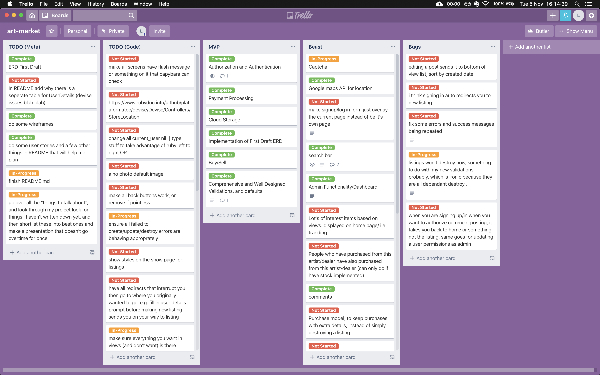

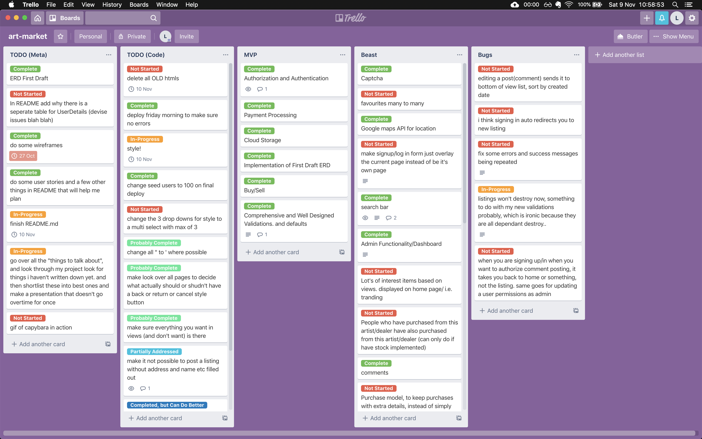

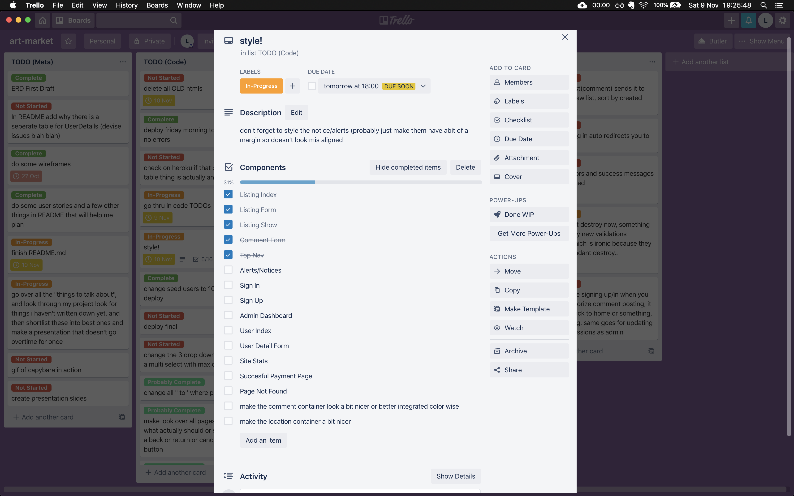

The general process I followed for this project was as follows:

1. Create a Trello board with high level tasks to create an MVP and cover all assignment requirements.
2. Create Wireframes to use as a guide to follow when creating my Views and Styling the website. 
3. Create an ERD to use as a guide to follow when coding my models and schema.
4. Generate models in rails including all references.
5. Create a Seed file that to fill the database with dummy data for testing.
6. Create Views and link them to the models with Controllers.
7. Leave validations until last to avoid spending lots of time troubleshooting.