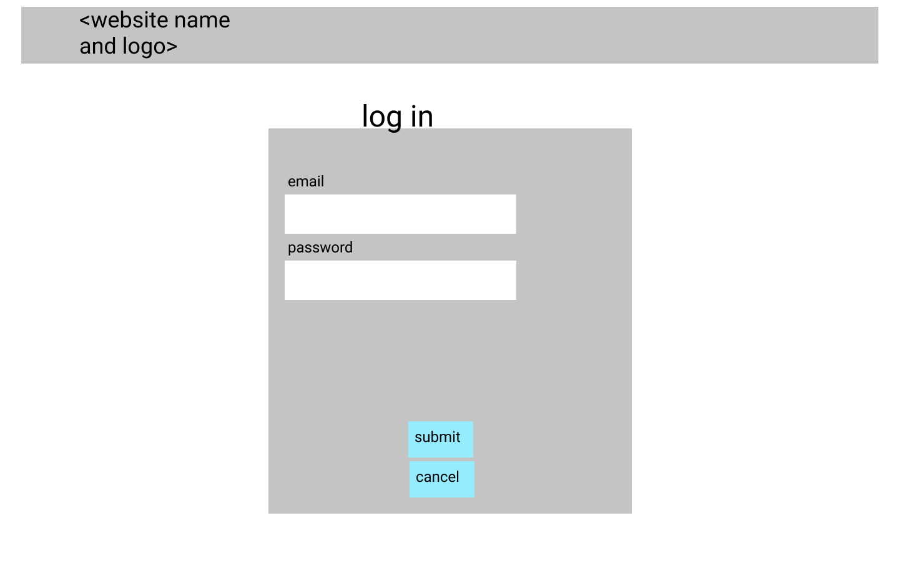

<TODO contents page>

* R13	Wireframes for your app
* R14	An ERD for your app
* R15	Explain the different high-level components (abstractions) in your app
* R16	Detail any third party services that your app will use
* R17	Describe your projects models in terms of the relationships (active record associations) they have with each other
* R18	Discuss the database relations to be implemented in your application
* R19	Provide your database schema design
* R20	Describe the way tasks are allocated and tracked in your project

# Levente Toth - T2A2 - Art Market

## The Problem

Artists are often limited by the decisions of art dealers, and galleries. Due to the constraints of finite space and time, as well as the desire for profit, dealers and galleries limit artist exposure, reach and profits.

## Why Solve this Problem?

Making it harder for artists to create and display their work through the above constraints means less art for the world. In an age approaching post-scarcity the human race needs more and more ways to ponder about themselves and their surroundings. More ways to find meaning, more ways to express themselves.

## The Website

<TODO deployed website link goes here>

## Source Control Repository

[GitHub Repo](https://github.com/LevPewPew/art-market)

## App Description

### Purpose

Remove the middle man (art dealer or gallery) and connect buyers directly with artists.

### Functionality/Features
- Database to track entities such as Users, Listings, etc
- Create user accounts with authorization and authentication (using Devise plug-in)
- Any User account can both buy and sell art
- User can post a listing to app for potential buyers to view or purchase
- User can browse art by
  - Trending
  - Artist
  - Style
  - Medium
- User can purchase listed art
- Payment Processing (using Stripe plug-in)
- Cloud Storage (using Amazon Web Services S3)
<TODO add more as theyre completed from beast mode or whatever>

### Sitemap

<TODO do once wireframes are made>

### Screenshots

<TODO add screens when app is completed>

### Target audience

Artists and those who appreciate art.

### Tech stack (e.g. html, css, deployment platform, etc)

- HTML
- CSS
- Ruby
- Ruby on Rails
- Heroku
- Stripe
- AWS S3

## User Stories

*Buying a Piece:*
The a brand new User will start browsing the listings on the home page and see a piece of art that looks interesting. They then click on that piece to see more high resolution photos and perhaps read a background on the piece or the artist. Deciding they would like to own the piece they then click a purchase button. Being a new user they have no account and are prompted to make a new one and enter their information. Once this is complete they enter payment details into the Stripe payment plug in to complete their purchase. A Purchase history is now present in their account.

*Selling a Piece:*
A new artist who already has an account logs in and decides they want to list one of their pieces. They go to their personal listings page which currently is empty. The click a New Listing button and are then taken to a new listing page where they fill in the details of their listing. Once they submit they are returned to their current listings page where they can see a new listing item that contains all the details they entered as well as the pick up location which is the address they have in their User account details.

## Wireframes

### Home Page

### Log In

### New User

### New/Edit Listing

### Show Listing

### Successful Listing

### Successful Purchase

### User Settings

## ERD

<TODO place here when app is finished as my first draft may end up changing>

<TODO all this stuff once app is complete>
## R15	Explain the different high-level components (abstractions) in your app
* R16	Detail any third party services that your app will use
* R17	Describe your projects models in terms of the relationships (active record associations) they have with each other
* R18	Discuss the database relations to be implemented in your application
* R19	Provide your database schema design
* R20	Describe the way tasks are allocated and tracked in your project
